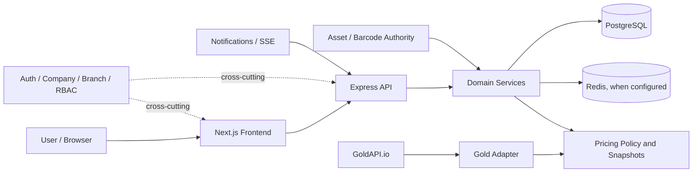

# DARFUS ERP

> A modular ERP platform for jewellery retail, gold operations, inventory, accounting, treasury, customer management, suppliers, POS, and Customer Gold Purchase (CGP) workflows.

[](https://nextjs.org/)
[](https://react.dev/)
[](https://nodejs.org/)
[](#current-project-status)

DARFUS is currently maintained as a local, evidence-backed ERP implementation. The approved local scope has passed integrated acceptance; server deployment and government e-invoicing work are intentionally deferred.

## Contents

- [Overview](#overview)
- [Current project status](#current-project-status)
- [Core capabilities](#core-capabilities)
- [Architecture](#architecture)
- [Core business rules](#core-business-rules)
- [Technology](#technology)
- [Repository structure](#repository-structure)
- [Getting started](#getting-started)
- [Environment configuration](#environment-configuration)
- [Database and migrations](#database-and-migrations)
- [Scripts and validation](#scripts-and-validation)
- [Source integrity](#source-integrity)
- [Security notes](#security-notes)
- [Deferred roadmap](#deferred-roadmap)
- [Development and handoff](#development-and-handoff)

## Overview

DARFUS provides a single-company, multi-branch operating model for jewellery and gold businesses. The application combines a Next.js frontend with an Express/Sequelize backend, PostgreSQL persistence, Redis-backed infrastructure where configured, and domain services for accounting, treasury, inventory, POS, suppliers, customers, reservations, notifications, and CGP.

ملخص عربي: النظام الحالي يغطي التشغيل المحلي المقبول للـERP، مع الحفاظ على سلطة الخادم في الشركة والفرع والحسابات والمخزون. النشر على Server أو تفعيل التكاملات الحكومية مؤجل بشكل صريح.

## Current project status

| Area | Current status |
|---|---|
| Local approved Product scope | Complete |
| Local integrated acceptance | Pass |
| Product blockers | 0 |
| Security blocker | None |
| Financial blocker | None |
| Data-integrity blocker | None |
| Migration blocker | None |
| Source provenance blocker | None |
| Source manifest | Confirmed |
| Persistent source migrations | 81 |
| Server / deployment | Deferred; not authorized |
| UAE / Government integration | Future scope |

The current source set is defined by the approved worktree content and source manifest. Historical `HEAD` alone is not the complete accepted Product source; do not reset or clean the worktree.

## Core capabilities

### Platform and access

- Authentication with server-side Company and Branch context.
- RBAC and fail-closed protected context resolution.
- Single-company, multi-branch operating model; the client cannot expand Company authority.

### Customer and POS

- Customer Master with canonical Primary Address handling and protected server-owned fields.
- POS Customer Summary: name, address, phone, classification, points, and total purchases.
- Universal product search by exact Barcode, Product code, safe ID, server-side name search, and bounded browse.
- Company/Branch-scoped availability enforcement, checkout, returns, and split/mixed payment.
- Approved desktop/tablet POS layout with customer, search/invoice, and payment areas.

### Inventory and printing

- Asset-owned physical inventory, stock movement, audit, transfer, and barcode identity.
- Barcode/tag printing and protected invoice/search/print flows.
- Making charge based on actual physical Asset gross weight.

### Supplier and gold operations

- Supplier Receive for Gold Bar 24K, Gold By Weight, and Gold By Piece.
- Supplier payable/accounting integration with historical purchase-price preservation.
- GoldAPI.io adapter architecture, normalized live quotes, pricing policy, immutable snapshots, AED support, and 18K/21K/22K/24K policy.

### Customer Gold Purchase (CGP)

- Canonical entry: Sales → Customer Gold Purchase Invoice.
- Lifecycle: `DRAFT → VALIDATED → POSTED`.
- Posting event: `CustomerGoldPurchasePostedEvent v1`.
- Accounting integration, reversal, settlement, recovery, governance, and a CGP-scoped dispatcher. The global dispatcher remains intentionally off.

### Financial and operational domains

- Accounting/GL, Treasury, Customer Credit, Reservations, Deposits, Refunds, Complete Sale, and receipt/history flows.
- Notifications Product Fix is closed; remaining runtime/UX validation limitations are non-blocking and documented.

## Architecture



The diagram describes current source architecture only; it is not a deployment topology or a production-readiness claim.

## Core business rules

### Company context

- Company context is server-side authoritative.
- Missing or invalid Company/Branch context fails closed.
- No hardcoded Company IDs and no first-active-branch fallback.

### Inventory

```text
ONE PHYSICAL PIECE = ONE ASSET = ONE UNIQUE BARCODE
```

`Product.quantity` is not the authority for physical stock. Asset identity, operational status, barcode, movement, and audit remain canonical.

### Making charge

```text
makingCharge = Asset.grossWeight × makingChargePerGram
```

There is no purity adjustment in this basis, and historical posted values remain frozen.

### CGP and accounting

CGP represents the Company buying gold from a Customer. Posting is gated by `VALIDATED`; payment is separate from posting. The canonical accounting semantic is:

```text
Dr INVENTORY_ASSET
Cr CUSTOMER_CREDITOR
```

CGP publishes the durable event and does not become the owner of Inventory, Accounting, or Gold Center truth.

### Invoice snapshot

Sale-time customer phone and canonical Primary Address are captured as immutable invoice contact evidence. Historical invoices do not silently read live Customer contact changes.

## Technology

| Layer | Technology |
|---|---|
| Frontend | Next.js 16.2.9, React 19.2.7, TypeScript 5.7.2, Tailwind CSS, next-intl |
| Backend | Node.js (backend requires >=18), Express, Sequelize |
| Data | PostgreSQL 16-compatible, Redis 7-compatible when configured |
| Validation | Playwright, contract tests, integration/runtime checks, static verifiers and guards |
| Package manager | npm |

## Repository structure

```text
.
├── app/                         Next.js routes and pages
├── components/                  Shared UI components
├── features/                    Domain-oriented frontend features
├── hooks/                       Shared React hooks
├── lib/                         Types, repositories, formatters, dates, permissions
├── messages/                    Arabic and English translations
├── backend/
│   ├── src/                     API, models, routes, and domain services
│   ├── migrations/              Current migration source (81 files)
│   ├── tests/                   Backend validation tests
│   ├── scripts/                 Backend guards and validation tooling
│   └── reports/                 Evidence only; not runtime Product source
├── tests/                       Frontend/contract validation tests
├── scripts/                     Static verifiers and acceptance helpers
└── docs/                        Engineering and project documentation
```

## Getting started

### Frontend

```bash
npm install
npm run typecheck
npm run dev
```

The local frontend is normally available at `http://localhost:3000`. Use `/ar/login` for Arabic or `/en/login` for English. Do not run `next dev` during controlled acceptance work; use the approved runtime/acceptance procedure for that context.

### Backend

```bash
cd backend
npm install
npm start
```

The backend default port is 8000 when configured locally. Review environment and database safety before starting it. Never point an acceptance migration command at a protected Persistent database.

### Database and Redis prerequisites

The repository includes a `docker-compose.yml` for local PostgreSQL and Redis development. Review its environment and startup command before use: it is not an acceptance or production deployment recipe. Persistent, Acceptance, and disposable Clone databases must remain explicitly identified and isolated.

## Environment configuration

Copy values from the example files into a private local environment; never commit real values. Common variable names include:

```text
NEXT_PUBLIC_API_URL=...
DATABASE_URL=...
DB_HOST=...
DB_PORT=...
DB_NAME=...
DB_USER=...
DB_PASS=...
DB_PASSWORD=...
DB_SSL=...
REDIS_URL=...
JWT_SECRET=...
JWT_REFRESH_SECRET=...
CORS_ALLOWED_ORIGINS=...
FRONTEND_URL=...
GOLD_API_PROVIDER=...
GOLD_API_KEY=...
```

Use strong secrets and environment-specific database settings. Gold API keys, JWT secrets, passwords, and full connection URLs must never appear in source, logs, screenshots, or this README.

## Database and migrations

The current source contains **81 migrations**. Migration source is reviewed and applied only through a controlled, target-verified process with a backup and a disposable rehearsal where required. Do not blindly run `npx sequelize-cli db:migrate` against a development default or any protected database. Do not treat the README as migration authorization.

## Scripts and validation

### Frontend commands

```bash
npm run typecheck
npm run lint
npm run build
npm start
```

### Browser and validation commands

```bash
npm run test:e2e
npm run test:print-export
npm run test:single-company-runtime
```

The repository also contains focused `verify:*`, `check:*`, `reconcile:*`, and `idempotency:*` scripts. Use the exact script named for the approved scope; do not infer a missing command from an old README.

Current source inventory includes 70 validation test files and 261 validation/verifier files. The verifier count includes static guards, integration helpers, and operational validation scripts; it is not a conventional test count or coverage claim.

## Source integrity

```text
SOURCE_FREEZE_MANIFEST_VERSION = LOCAL_ACCEPTED_SOURCE_FREEZE_V1
SOURCE_FREEZE_MANIFEST_SHA256 = DF1F9651466240296B282C14B6C62532A2EBC74719C0AE8B93CCA8FD9B1838F7
LOCAL_ACCEPTED_RELEASE_SOURCE_ID = DARFUS-LOCAL-ACCEPTED-SOURCE-V1-DF1F9651
```

The accepted source includes inherited worktree content not fully represented by historical `HEAD`. Do not use `git reset --hard` or `git clean -fd`; both can destroy accepted local source. Reports, private environment files, generated output, `node_modules`, and backups are excluded from the runtime Product artifact.

## Security notes

- Company and Branch context are enforced server-side and fail closed.
- RBAC and permission checks are backend authorities, not frontend-only visibility.
- No hardcoded Company IDs or financial authority fallbacks.
- Secrets remain in private environment configuration and are never committed.
- Gold API keys are never exposed to the browser.
- This README makes no penetration-testing, certification, legal-compliance, or deployment claim.

## Deferred roadmap

The following are future/deferred scope, not current Product blockers:

- UAE E-Invoicing production integration.
- Government Integration, ASP, Peppol/UBL, registration, certification, and sandbox work.
- Production eInvoice activation.
- Broader CGP automation if the Owner changes scope.
- Optional future POS redesign work.
- Server readiness, deployment planning, and production deployment.

Architecture/reference work may exist for some future areas, but DARFUS does not claim UAE compliance, FTA approval, Peppol certification, or server production deployment.

## Development and handoff

Before resuming local work, read:

1. `AGENTS.md`
2. `PROJECT_PROGRESS_HANDOFF.md`
3. The latest source-freeze and closure reports under `backend/reports/`

The current handoff is the authority for scope, blockers, database identities, migration split, deferred work, and safe next steps. Do not start from old prompts, do not assume server readiness, and do not modify the Persistent database during rehearsal or acceptance work.

The latest local scope is accepted. The next documented local step is `LOCAL-PROJECT-FINAL-CLOSURE-01`; it requires an explicit Owner start and is not launched automatically.
