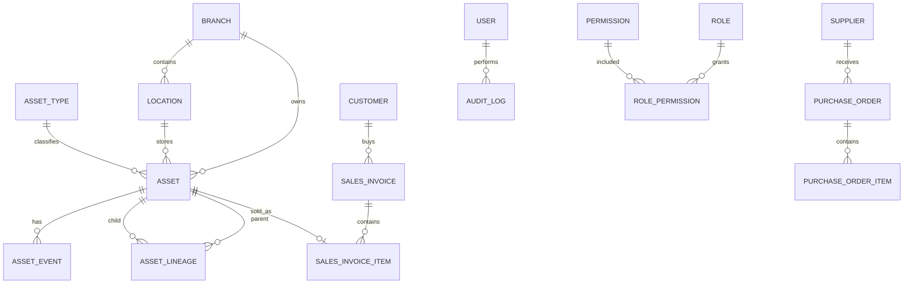

# DARFUS — Production Architecture Proposal

## 1. Core principle

DARFUS must be implemented as an **asset-centric system**. A jewellery item is not only a product row; it is a permanent asset identity with lifecycle, lineage, current state, branch/location and immutable audit history.

## 2. Recommended stack

- Frontend: Next.js 16, TypeScript, Tailwind CSS.
- Backend: NestJS, Laravel, or ASP.NET Core.
- Database: PostgreSQL.
- Cache/queues: Redis.
- Files: S3-compatible object storage.
- Search: PostgreSQL full-text initially; OpenSearch later.
- Realtime: WebSocket/SSE for POS, RFID audits and branch transfers.

## 3. Main bounded contexts

1. Identity and access.
2. Branches and locations.
3. Asset registry.
4. Inventory movements.
5. Sales and POS.
6. Purchases and suppliers.
7. Customer CRM and loyalty.
8. Accounting and posting.
9. Manufacturing, melting and conversion.
10. RFID/barcode audits.
11. Reporting.
12. Configuration and workflow engine.
13. Immutable audit trail.

## 4. Core database entities

## 5. Required asset fields

- `id`: internal UUID, never reused.
- `asset_code`: human-readable permanent ID.
- `barcode`: unique, never reused.
- `rfid_tag`: optional unique tag.
- `asset_type_id`.
- `status_id`.
- `branch_id` and `location_id`.
- gross/net/pure weight.
- karat/purity.
- stones and pearls breakdown.
- cost, pricing rule and current selling price.
- source type and source document.
- current version for optimistic locking.

## 6. Immutable event model

Every important action must append an event instead of silently overwriting history:

- created
- received
- quality_checked
- transferred
- reserved
- sold
- returned
- sent_to_repair
- repaired
- melted
- manufactured
- converted
- adjusted
- archived

An asset event stores: actor, timestamp, device, branch, reason, before snapshot, after snapshot and source document.

## 7. Posting rule

Draft documents may be edited. Posted documents must not be edited directly. Correction requires one of:

- reversal document;
- approved amendment workflow;
- return/exchange document;
- inventory adjustment with reason and permission.

## 8. Configuration-first design

The following must be database-driven:

- asset types;
- karat/purity lists;
- statuses and allowed transitions;
- payment methods;
- invoice templates;
- barcode formats;
- branches and locations;
- roles and permissions;
- reasons lists;
- report filters;
- taxes and posting routes;
- workflow steps.

## 9. Security requirements

- MFA for privileged users.
- Device/session tracking.
- Branch-level data scope.
- Action-level permissions.
- Approval thresholds.
- immutable audit records.
- encryption at rest for sensitive customer documents.
- rate limiting and idempotency keys for posting endpoints.

## 10. UAE requirements

Tax and compliance behavior must be validated by a UAE accountant/legal specialist before production. Keep VAT rules, AML flags, UUID/QR formats and government integrations configurable and versioned.
